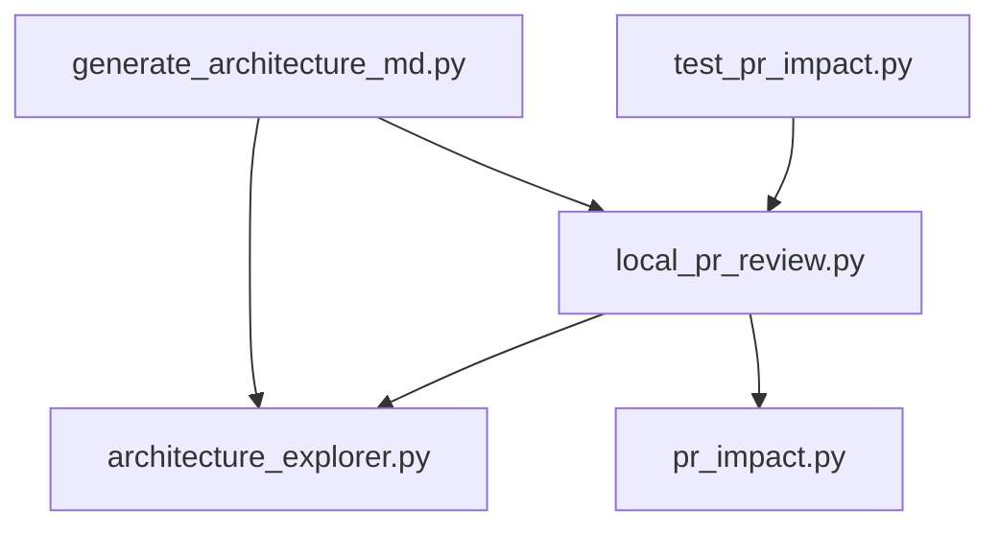
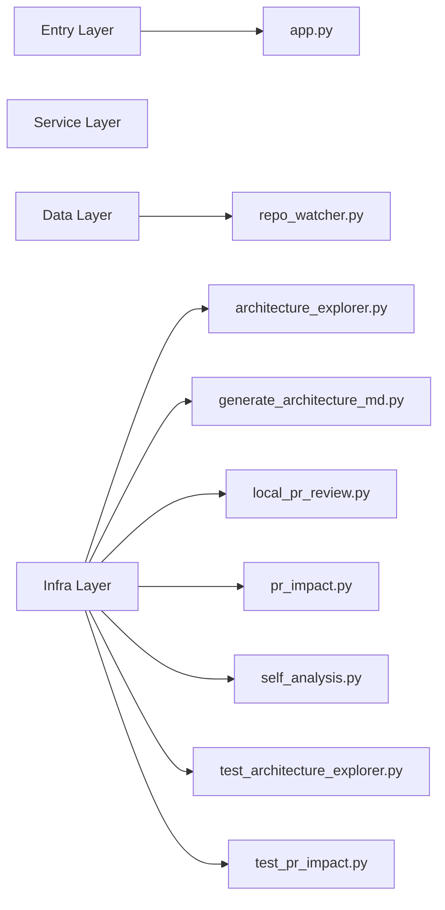

# Local Architecture PR Review: 23ed66fec016e4f619df6439b3d967b6c9ffad10 -> 7b7b557043b940185c405fdfff7cf346815aed10

- Base commit: `23ed66fec016e4f619df6439b3d967b6c9ffad10`
- Head commit: `7b7b557043b940185c405fdfff7cf346815aed10`
- Base tree files: 24
- Head tree files: 26
- Git diff paths: .github/workflows/architecture-pr-check.yml, generate_architecture_md.py, local_pr_review.py
- Changed files: .github/workflows/architecture-pr-check.yml, generate_architecture_md.py, local_pr_review.py
- Removed files: none
- Impact summary: {'total_changed': 3, 'total_removed': 0, 'total_impacted': 7}

## HLD Diagram

## Dependency Impact Diagram

## Layer Diagram

## Architecture Review

# Architecture Review Summary

## HLD Impact
- Changed files: .github/workflows/architecture-pr-check.yml, generate_architecture_md.py, local_pr_review.py
- Components affected: generate_architecture_md.py, generate_architecture_md.py -> architecture_explorer.py, generate_architecture_md.py -> local_pr_review.py, local_pr_review.py, local_pr_review.py -> architecture_explorer.py, local_pr_review.py -> pr_impact.py, test_pr_impact.py -> local_pr_review.py
- Risk: High
- Architectural note: review dependency boundaries and service entry points before merge.

## LLD Impact
- Changed implementation blocks:
- generate_architecture_md.py | classes: none | functions: generate_architecture_md, main
- local_pr_review.py | classes: none | functions: _git_diff_stats, _categorize_paths, _python_symbols, _changed_python_symbols, render_html_report, _git_files, _git_value, _git_diff_status, _materialize_commit, run

## Reviewer Guidance
- Confirm the change is limited to the intended layer.
- Validate downstream calls and imports for blast radius.
- Check whether a shared component or service is now coupled to the modified module.
