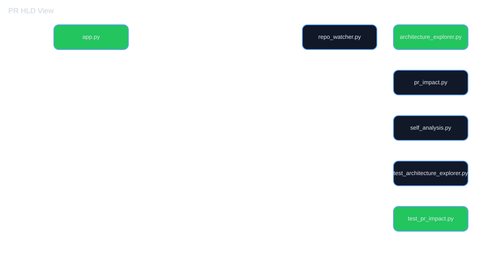
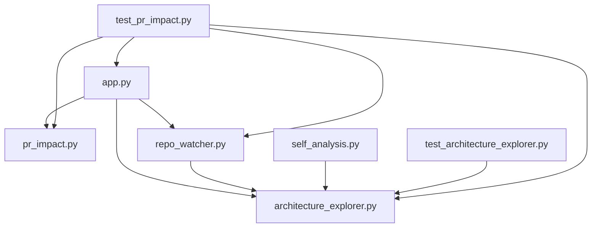
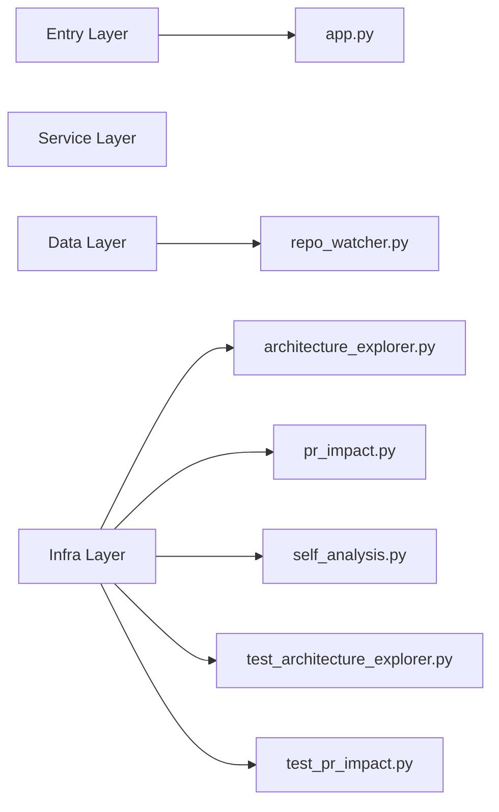

# Local Architecture PR Review: 57ba752 -> d59f4c7

- Base commit: `57ba752`
- Head commit: `d59f4c7`
- Base tree files: 19
- Head tree files: 19
- Git diff paths: README.md, app.py, architecture_explorer.py, tests/test_pr_impact.py
- Changed files: README.md, app.py, architecture_explorer.py, tests/test_pr_impact.py
- Removed files: none
- Impact summary: {'total_changed': 4, 'total_removed': 0, 'total_impacted': 13}

## HLD Diagram

## Dependency Impact Diagram

## Layer Diagram

## Architecture Review

# Architecture Review Summary

## HLD Impact
- Changed files: README.md, app.py, architecture_explorer.py, tests/test_pr_impact.py
- Components affected: app.py, app.py -> architecture_explorer.py, app.py -> pr_impact.py, app.py -> repo_watcher.py, architecture_explorer.py, repo_watcher.py -> architecture_explorer.py, self_analysis.py -> architecture_explorer.py, test_architecture_explorer.py -> architecture_explorer.py, test_pr_impact.py, test_pr_impact.py -> app.py, test_pr_impact.py -> architecture_explorer.py, test_pr_impact.py -> pr_impact.py, test_pr_impact.py -> repo_watcher.py
- Risk: High
- Architectural note: review dependency boundaries and service entry points before merge.

## LLD Impact
- Changed implementation blocks:
- app.py | classes: none | functions: _analyze_current_repo, _post_github_issue_comment, _github_get_json, _fetch_pr_file_changes, index, api_summary, api_mermaid, api_graph, api_module_details, api_pr_comment, api_github_pr_comment, api_pr_summary, api_pr_review, api_watcher_status, api_refresh, api_github_pr_webhook
- architecture_explorer.py | classes: none | functions: _classify_layer, _module_lookup, _read_python_file, _iter_python_files, _safe_name, _extract_module_info, analyze_project, render_hld_markdown, render_lld_markdown, render_hld_html, render_lld_html, build_dashboard_payload, build_project_snapshot, build_mermaid_diagram, build_layer_mermaid, build_impact_mermaid, build_pr_review_artifacts, build_svg_graph, build_module_details, layer_for
- test_pr_impact.py | classes: FakeResponse | functions: test_build_project_snapshot_groups_modules_by_layer, test_pr_impact_flags_changed_dependencies, test_build_mermaid_diagram_contains_nodes_and_edges, test_app_exposes_summary_and_mermaid_api, test_repo_watcher_detects_changes_and_status, test_app_refresh_endpoint_updates_snapshot_and_status, test_github_pr_webhook_generates_architecture_review_summary, test_github_pr_webhook_validates_signature_and_uses_diff_data, test_pr_review_artifacts_include_multiple_diagrams, test_webhook_persists_diagram_first_review, test_github_webhook_secret_can_be_loaded_from_environment, test_hld_is_first_and_module_details_are_clickable, test_pr_view_highlights_additions_and_deletions_in_svg, test_module_details_api_returns_real_component_data, test_svg_graph_supports_layer_and_depth_filters, test_pr_comment_generation_for_selected_component, test_graph_api_applies_browser_filters, test_github_pr_comment_posts_architecture_context, test_architecture_quality_classifies_real_layers_and_dependencies, test_pr_impact_quality_tracks_real_blast_radius_not_just_changed_files, __enter__, __exit__, read

## Reviewer Guidance
- Confirm the change is limited to the intended layer.
- Validate downstream calls and imports for blast radius.
- Check whether a shared component or service is now coupled to the modified module.
