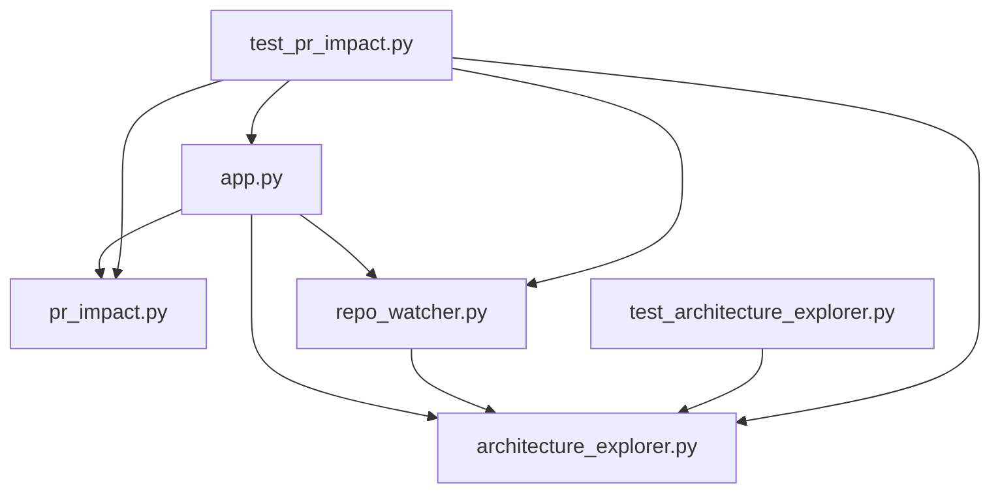

# Repo Architecture Explorer: Self-Analysis

> Generated from the repository itself with `python self_analysis.py`.

## Verification Snapshot

- Project: `repo-architecture-explorer`
- Modules: `6`
- Entrypoint: `app.py`
- Layers: `entry=1`, `service=0`, `data=1`, `infra=4`
- Internal dependency edges: `9`
- Dashboard route smoke checks: passing
- Automated verification: `21 passed`

## High Level Design

The explorer analyzes its own Flask application as the entry layer. The application coordinates three core capabilities:

- `architecture_explorer.py`: AST scanning, layer classification, HLD/LLD rendering, Mermaid output, SVG graph rendering, and nested module resolution.
- `pr_impact.py`: changed-file comparison, impacted module detection, risk summary, and reviewer guidance.
- `repo_watcher.py`: repository file-state tracking, stale detection, and forced refresh.

The test modules consume the analyzer and impact engine. The main runtime flow is:

```text
app.py
  -> architecture_explorer.py
  -> pr_impact.py
  -> repo_watcher.py
       -> architecture_explorer.py
```

## Low Level Design

| Module | Layer | Main responsibilities |
| --- | --- | --- |
| `app.py` | entry | Flask dashboard, graph APIs, module drilldown, webhook validation, GitHub comments |
| `architecture_explorer.py` | infra | AST parsing, module lookup, layer classification, HLD/LLD, SVG and Mermaid rendering |
| `pr_impact.py` | infra | PR file comparison, impact mapping, risk summary, reviewer guidance |
| `repo_watcher.py` | data | File-state snapshots, change detection, refresh, watcher status |
| `test_architecture_explorer.py` | infra | Analyzer and rendering regression tests |
| `test_pr_impact.py` | infra | PR, API, webhook, filter, and GitHub integration tests |

## Internal Component Drilldown

### `app.py`

- Layer: `entry`
- Depends on: `architecture_explorer.py`, `pr_impact.py`, `repo_watcher.py`
- Used by: `test_pr_impact.py`
- Important functions: `index`, `api_summary`, `api_graph`, `api_module_details`, `api_github_pr_webhook`, `api_github_pr_comment`

### `architecture_explorer.py`

- Layer: `infra`
- Used by: `app.py`, `repo_watcher.py`, `test_architecture_explorer.py`, `test_pr_impact.py`
- Important functions: `analyze_project`, `build_project_snapshot`, `build_mermaid_diagram`, `build_svg_graph`, `build_module_details`, `render_hld_markdown`, `render_lld_markdown`

### `pr_impact.py`

- Layer: `infra`
- Used by: `app.py`, `test_pr_impact.py`
- Important functions: `analyze_pr_impact`, `render_pr_impact_summary`

### `repo_watcher.py`

- Layer: `data`
- Depends on: `architecture_explorer.py`
- Used by: `app.py`, `test_pr_impact.py`
- Important functions: `scan`, `has_changes`, `force_refresh`, `status`

## Mermaid Dependency Graph



## Reproduce

From the repository root:

```powershell
python self_analysis.py
python self_analysis.py > docs/self-analysis.md
python -m pytest -q
```
