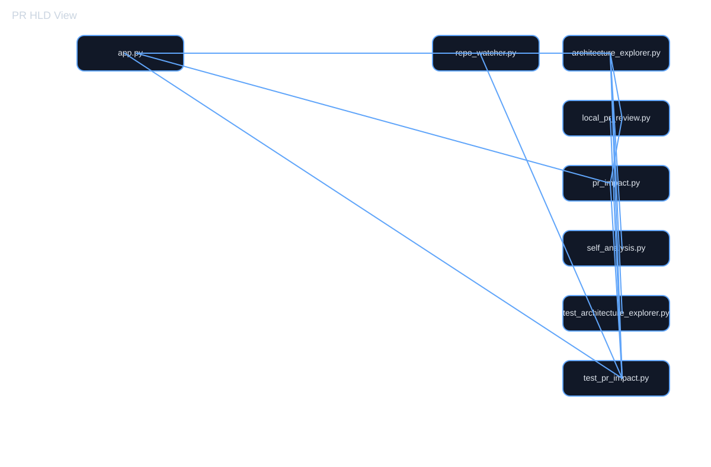
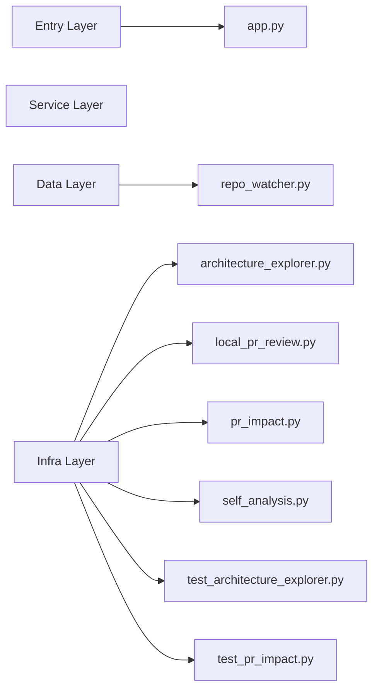

# Local Architecture PR Review: 91f2c9da7829354babd22bfb1c1445b75a777cb7 -> 34ad969fba622d05eeba81a468788e069f52bcad

- Base commit: `91f2c9da7829354babd22bfb1c1445b75a777cb7`
- Head commit: `34ad969fba622d05eeba81a468788e069f52bcad`
- Base tree files: 24
- Head tree files: 24
- Git diff paths: .github/workflows/publish-architecture-pages.yml, README.md
- Changed files: .github/workflows/publish-architecture-pages.yml, README.md
- Removed files: none
- Impact summary: {'total_changed': 2, 'total_removed': 0, 'total_impacted': 0}

## HLD Diagram

## Dependency Impact Diagram

## Layer Diagram

## Architecture Review

# Architecture Review Summary

## HLD Impact
- Changed files: .github/workflows/publish-architecture-pages.yml, README.md
- Components affected: no direct module impact detected
- Risk: Medium
- Architectural note: review dependency boundaries and service entry points before merge.

## LLD Impact
- Changed implementation blocks:
- No directly impacted low-level modules detected.

## Reviewer Guidance
- Confirm the change is limited to the intended layer.
- Validate downstream calls and imports for blast radius.
- Check whether a shared component or service is now coupled to the modified module.
